# Restful-Booker Platform — Manual Test Tutorial

## Introduction

This tutorial guides a manual tester through validating the Restful-Booker Platform web UI. It includes three test scenarios with step-by-step instructions, expected results, and reference screenshots.

|  |  |
|---|---|
| **Format** | Step–Action–Expected Result |
| **System Under Test** | Restful-Booker Platform (Shady Meadows B&B) |
| **Browser** | Google Chrome (latest stable) |
| **URL** | http://localhost |
| **Credentials** | Username: `admin` / Password: `password` |

---

## Prerequisites

Before executing these tests, complete the following setup:

### 1. Clone the Test Automation Demo Repository

```bash
git clone --recurse-submodules https://github.com/ddreakford/test-automation-demo.git
cd test-automation-demo
```

> If you already cloned without `--recurse-submodules`, run:
> ```bash
> git submodule init && git submodule update
> ```

### 2. Start the Restful-Booker Platform

```bash
cd restful-booker-platform
DOCKER_DEFAULT_PLATFORM=linux/amd64 docker compose up -d
cd ..
```

Wait 15–20 seconds for all services to initialise, then verify:

```bash
curl -s -o /dev/null -w "HTTP %{http_code}\n" http://localhost
# Expected: HTTP 200
```

### 3. Open the Application

Open Google Chrome and navigate to **http://localhost**. You should see the Shady Meadows B&B homepage.

- [ ] Docker containers are running (`docker compose ps` shows 7 services)
- [ ] Homepage loads at http://localhost

---

## Test Scenario 1: Validate the Homepage UI

| | |
|---|---|
| **ID** | TC-UI-001 |
| **Title** | Validate Restful-Booker Platform Homepage Elements |
| **Priority** | High |
| **Preconditions** | SUT is running. Browser is open to http://localhost. |

### Test Steps

| Step | Action | Expected Result | Pass/Fail |
|------|--------|-----------------|-----------|
| 1 | Navigate to **http://localhost** | The Shady Meadows B&B homepage loads with a hero banner image. | |
| 2 | Verify the welcome heading and description text in the hero section. | The heading reads **"Welcome to Shady Meadows B&B"**. Below it, a paragraph reads: *"Welcome to Shady Meadows, a delightful Bed & Breakfast nestled in the hills on Newingtonfordburyshire. A place so beautiful you will never want to leave. All our rooms have comfortable beds and we provide breakfast from the locally sourced supermarket. It is a delightful place."* | |
| 3 | Verify the **"Book Now"** button is visible in the hero section. | A blue **"Book Now"** button is displayed below the welcome text. | |
| 4 | Verify the navigation bar at the top of the page. | The nav bar contains links: **Rooms**, **Booking**, **Amenities**, **Location**, **Contact**, **Admin**. The hotel name **"Shady Meadows B&B"** appears on the left. | |
| 5 | Scroll down to the **"Check Availability & Book Your Stay"** panel. | A card panel is displayed with a **"Check In"** date field, a **"Check Out"** date field, and a blue **"Check Availability"** button. | |
| 6 | Scroll down to the **"Our Rooms"** section. | Three room cards are displayed: **Single** (£100/night), **Double** (£150/night), and **Suite** (£225/night). Each card has a thumbnail photo, description text, feature badges (TV, WiFi, Radio, Safe), and a blue **"Book now"** button. | |
| 7 | Scroll down to the **"Our Location"** section. | A map is displayed on the left. On the right, a **"Contact Information"** card shows: **Address** (Shady Meadows B&B, Shadexx valley, Newingtonfordburyshire, Gibury, NY 1AA), **Phone** (01234567801), and **Email** (fake@fakeemail.com). Below is a **"Getting Here"** section with directions text. | |
| 8 | Scroll down to the **"Send Us a Message"** section. | A form is displayed with fields: **Name**, **Email**, **Phone**, **Subject**, and **Message** (text area), plus a blue **"Submit"** button. | |
| 9 | Scroll to the bottom of the page (footer). | The footer has a dark background and contains: the hotel name and description, a **"Contact Us"** section with address/phone/email, a **"Quick Links"** section, and social media icon buttons. A version line reads *"restful-booker-platform v2.0"*. | |

### Reference Screenshots

| Step | Screenshot |
|------|------------|
| 1–3 | 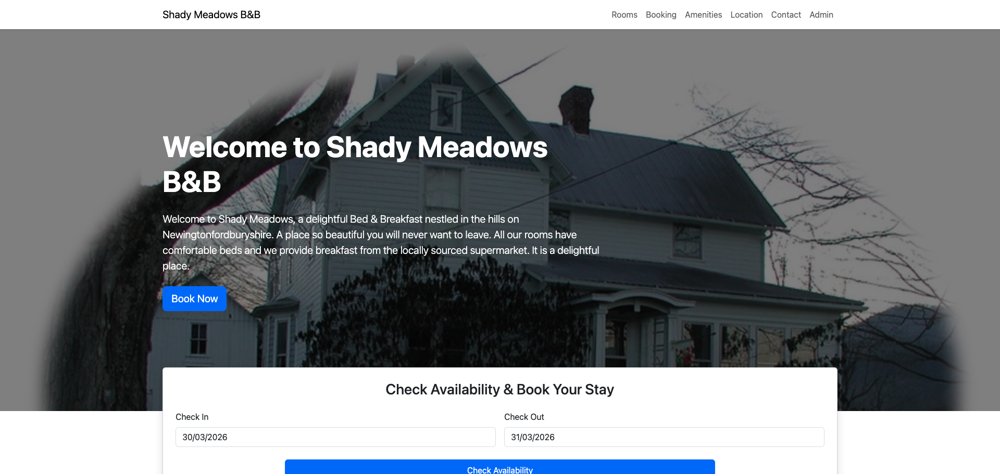 |
| 5 | 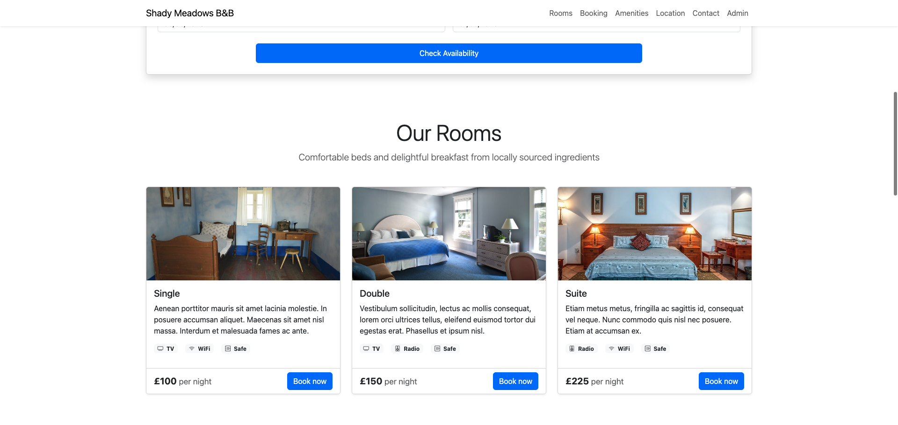 |
| 6 | 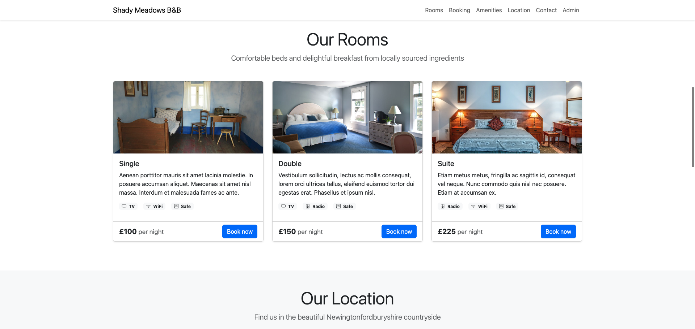 |
| 7 | 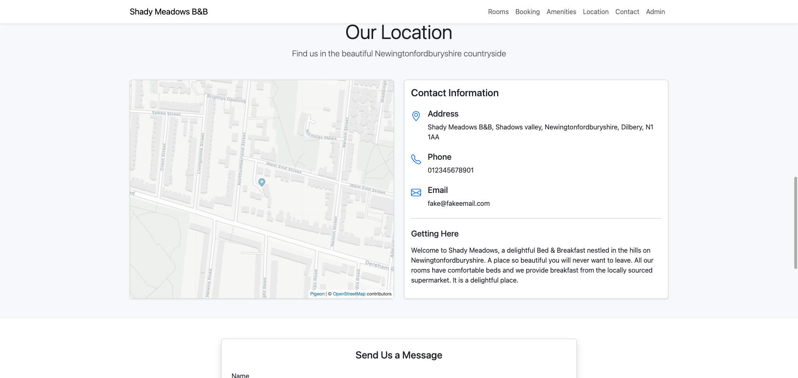 |
| 8 | 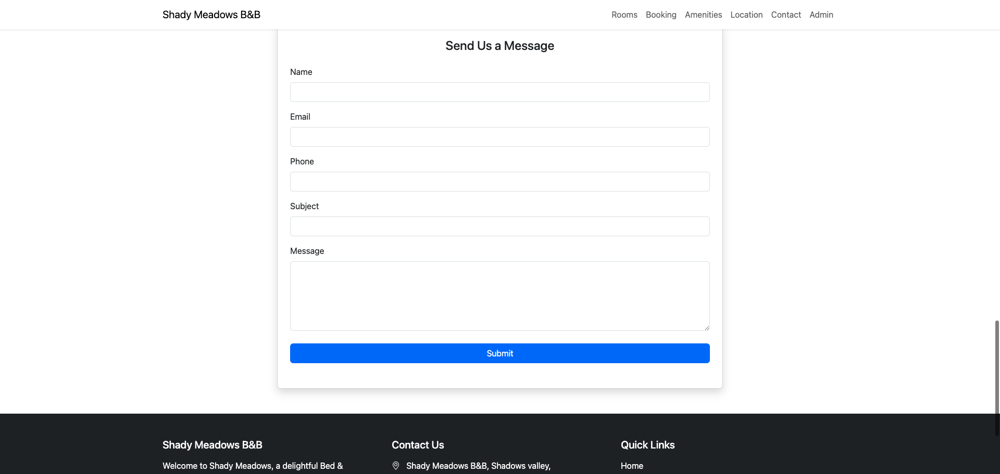 |
| 9 | 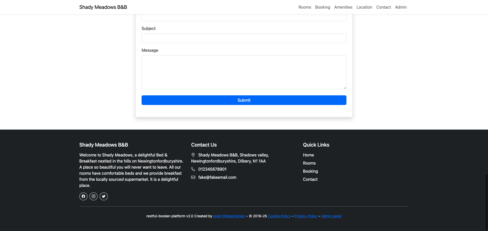 |

---

## Test Scenario 2: Book a Room

| | |
|---|---|
| **ID** | TC-BOOK-001 |
| **Title** | Book a Suite Room via the Homepage |
| **Priority** | Critical |
| **Preconditions** | SUT is running. Browser is open to http://localhost. Homepage has loaded. |

### Test Steps

| Step | Action | Expected Result | Pass/Fail |
|------|--------|-----------------|-----------|
| 1 | Click the **"Book Now"** button in the hero section. | The page scrolls smoothly so that the **"Check Availability & Book Your Stay"** panel is positioned at the top of the viewport. | |
| 2 | Click the **"Check In"** date field and select a date **2 weeks from today**. | The date picker opens. After selecting a date, the field displays the chosen date in MM/DD/YYYY format. | |
| 3 | Click the **"Check Out"** date field and select a date **3 days after the check-in date**. | The field displays the chosen check-out date. | |
| 4 | Click the **"Check Availability"** button. | The page refreshes the **"Our Rooms"** section below. Three room cards are displayed: **Single**, **Double**, and **Suite**, each with a **"Book now"** button. | |
| 5 | Locate the **Suite** room card (£225/night). Verify it shows features: **Radio**, **WiFi**, **Safe**. | The Suite card displays the room image, description, feature badges, and price. | |
| 6 | Click the **"Book now"** button on the **Suite** card. | The browser navigates to the **Suite Room reservation page**. The page shows: a breadcrumb trail (Home > Rooms > Suite Room), the room title **"Suite Room"**, an **"Accessible"** badge, **"Max 2 Guests"**, a large room photo, and a **"Book This Room"** sidebar on the right with the price **£225** per night. | |
| 7 | On the reservation page, review the **Room Description** section. | A description paragraph is displayed below the room photo. | |
| 8 | Review the **Room Features** section. | Icons and labels for **Radio**, **WiFi**, and **Safe** are displayed. | |
| 9 | Review the **Room Policies** section. | Two cards are shown: **Check-in & Check-out** (Check-in: 3:00 PM – 8:00 PM, Check-out: By 11:00 AM, Early/Late: By arrangement) and **House Rules** (No smoking, No parties or events, Pets allowed (restrictions apply)). | |
| 10 | In the **"Book This Room"** sidebar, verify the calendar shows the current month with selectable dates. Select your desired dates by clicking on the calendar cells (click the start date, then click the end date). | The selected date range is highlighted in blue. Below the calendar, a **"Price Summary"** box appears showing: nightly rate x number of nights, a Cleaning fee (£25), a Service fee (£15), and a **Total**. | |
| 11 | Click the **"Reserve Now"** button. | The sidebar changes to show a customer details form with fields: **Firstname**, **Lastname**, **Email**, **Phone**. The Price Summary remains visible. A **"Reserve Now"** and **"Cancel"** button are shown. | |
| 12 | Fill in the form: **Firstname:** `Jane`, **Lastname:** `Doe`, **Email:** `jane.doe@example.com`, **Phone:** `01234567890`. | All fields accept input. No validation errors appear. | |
| 13 | Click the **"Reserve Now"** button to submit the booking. | The sidebar changes to display a **"Booking Confirmed"** message: *"Your booking has been confirmed for the following dates:"* followed by the check-in and check-out dates. A **"Return home"** button is displayed. | |
| 14 | Click the **"Return home"** button. | The browser navigates back to the homepage (http://localhost). | |

### Reference Screenshots

| Step | Screenshot |
|------|------------|
| 1 | 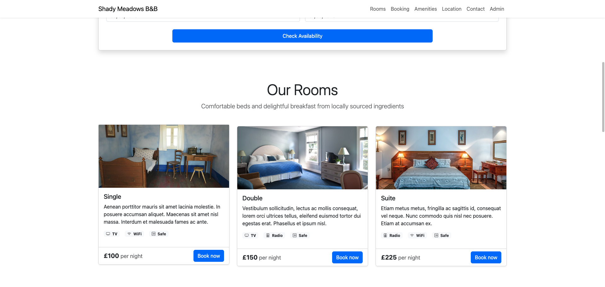 |
| 4 | 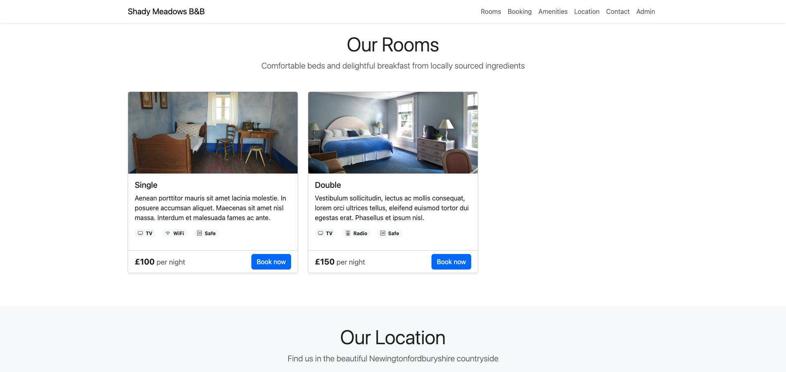 |
| 5 | 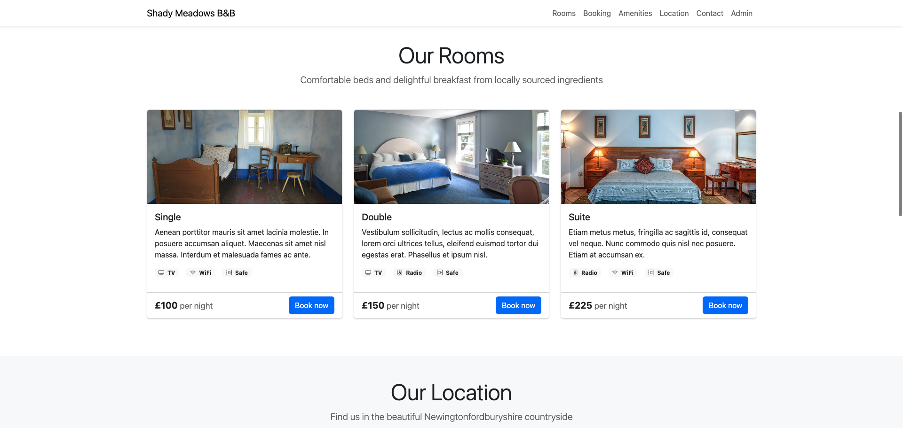 |
| 6–7 | 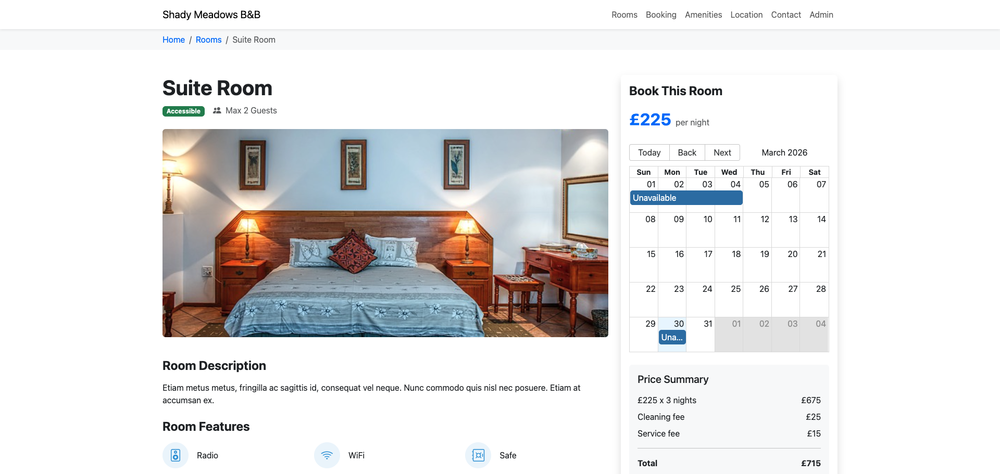 |
| 8–9 | 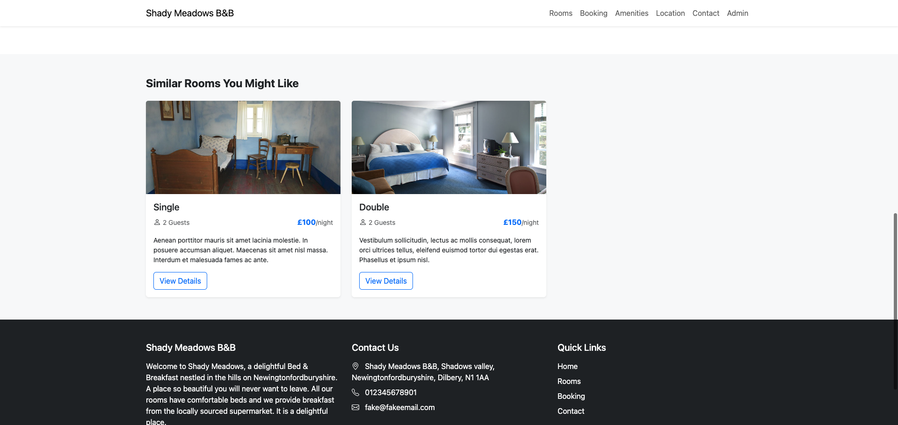 |
| 10–11 | 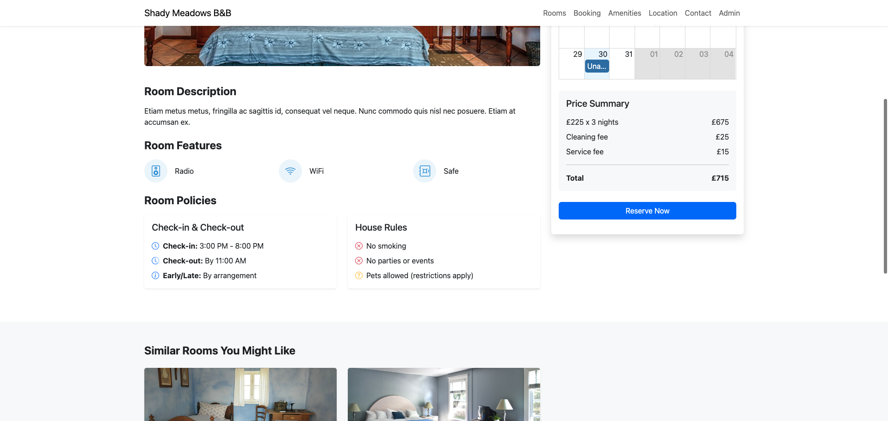 |
| 12 | 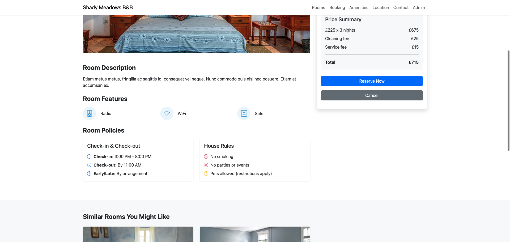 |
| 13 | 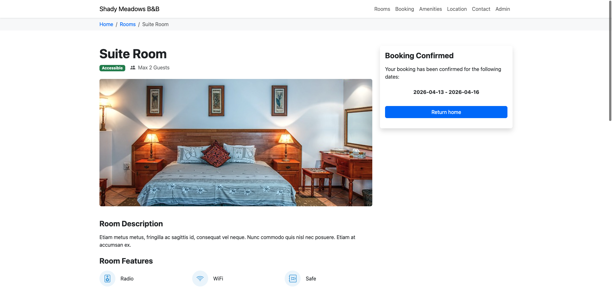 |

---

## Test Scenario 3: Send Us a Message

| | |
|---|---|
| **ID** | TC-MSG-001 |
| **Title** | Submit a Contact Message via the Homepage Form |
| **Priority** | Medium |
| **Preconditions** | SUT is running. Browser is open to http://localhost. Homepage has loaded. |

### Test Steps

| Step | Action | Expected Result | Pass/Fail |
|------|--------|-----------------|-----------|
| 1 | Scroll down to the **"Send Us a Message"** section (or click **"Contact"** in the navigation bar). | The contact form is visible with five fields: **Name**, **Email**, **Phone**, **Subject**, and a **Message** text area. A blue **"Submit"** button is at the bottom. All fields are empty. | |
| 2 | Enter the following information: | All fields accept input without errors. | |
| | **Name:** `John Smith` | | |
| | **Email:** `john.smith@example.com` | | |
| | **Phone:** `01234987654` | | |
| | **Subject:** `Booking Inquiry - Anniversary Weekend` | | |
| | **Message:** `Hello, my wife and I are celebrating our 10th anniversary and would like to book your Suite for the weekend of the 15th. Do you have availability? We would also appreciate any recommendations for local restaurants. Thank you!` | | |
| 3 | Click the **"Submit"** button. | The form is replaced by a confirmation message: **"Thanks for getting in touch John Smith!"** followed by *"We'll get back to you about"* and the subject line **"Booking Inquiry - Anniversary Weekend"** displayed in bold, then *"as soon as possible."* | |
| 4 | Navigate back to the homepage by clicking **"Shady Meadows B&B"** in the navigation bar, or refreshing the page. | The homepage reloads. Scrolling to the contact section shows the form is empty again (reset). | |

### Reference Screenshots

| Step | Screenshot |
|------|------------|
| 1 | 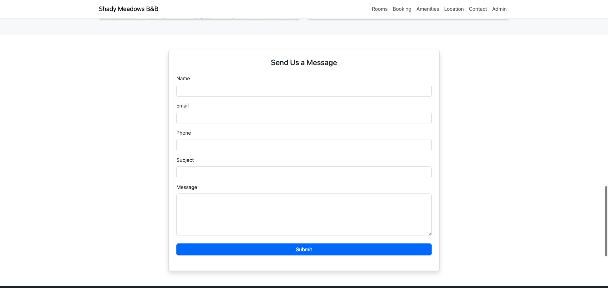 |
| 2 | 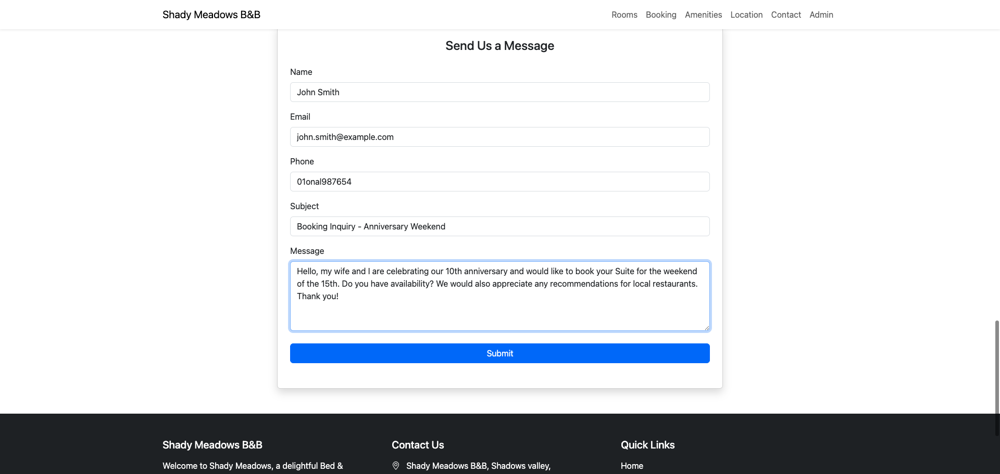 |
| 3 | 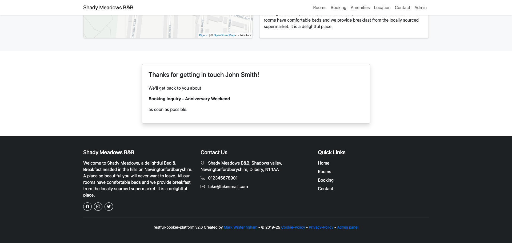 |

---

## Test Scenario 4: Root Cause Analysis (RCA) Demo — Intentional Failures

| | |
|---|---|
| **ID** | TC-RCA-001 / TC-RCA-002 |
| **Title** | Intentional Test Failures for Allure RCA Walkthrough |
| **Priority** | N/A — these are demonstration scenarios, not real defects |
| **Preconditions** | SUT is running. Automated test suite has been executed including the RCA demo (`./gradlew rcaDemo`). Allure report is open. |

### Purpose

These scenarios contain **deliberate test defects** — the system under test behaves correctly, but the test assertions are intentionally wrong. The goal is to practice root cause analysis using the Allure dashboard: distinguishing between a **test defect** (wrong assertion) and a **system defect** (broken functionality).

This is a key skill for QA interviews and day-to-day triage work.

### RCA-001: API — Booking Status Code Mismatch

| Step | Action | Expected Result | Pass/Fail |
|------|--------|-----------------|-----------|
| 1 | Run the RCA demo suite: `cd rbp-test-demo && ./gradlew rcaDemo` | Build succeeds. Two tests run and both **FAIL** (this is expected). | |
| 2 | Open the Allure report: `./gradlew allureServe` | The Allure dashboard opens. The Overview shows 2 failed tests under the **"RCA Demo"** epic. | |
| 3 | Click the failing test **"RCA-001: Booking creation returns wrong status code"**. | The test detail page opens showing the assertion error. | |
| 4 | In the **Assertion** section, read the error message. | The message reads: *"Expected status code 200 but was 201"*. | |
| 5 | Expand the **Request** attachment. | Shows the full HTTP POST body sent to `/booking/` — a valid booking JSON with firstname, lastname, dates. The request is correct. | |
| 6 | Expand the **Response** attachment. | Shows HTTP 201 Created with a `bookingid` in the response body. The service behaved correctly. | |
| 7 | **Conclude the RCA.** | **Root cause:** This is a **test defect**, not a system defect. The API correctly returns HTTP 201 Created for a new booking. The test assertion was misconfigured to expect HTTP 200 OK. The fix would be to change `.statusCode(200)` to `.statusCode(201)` in the test code. | |

### RCA-002: UI — Homepage Heading Text Mismatch

| Step | Action | Expected Result | Pass/Fail |
|------|--------|-----------------|-----------|
| 1 | In the same Allure report, click the failing test **"RCA-002: Homepage heading asserts wrong hotel name"**. | The test detail page opens showing the assertion error. | |
| 2 | Read the assertion error message. | The message reads: *"Expected heading to contain 'Welcome to Grand Hotel' but found: 'Welcome to Shady Meadows B&B'"*. | |
| 3 | Click the **"Failure Screenshot"** attachment. | A screenshot of the homepage is displayed, clearly showing the heading **"Welcome to Shady Meadows B&B"**. The UI is correct. | |
| 4 | **Conclude the RCA.** | **Root cause:** This is a **test defect**. The tester hardcoded the wrong expected hotel name ("Grand Hotel" instead of "Shady Meadows B&B"). The UI displays the correct name. The fix would be to update the expected text in the test assertion. | |

### Key Takeaway

> In both cases, the system under test is behaving correctly. The failures are caused by **misconfigured test assertions**. This distinction — test defect vs system defect — is critical for effective test triage and is a strong talking point in interviews.

---

## Test Execution Summary

| Test Case ID | Title | Status | Tester | Date |
|---|---|---|---|---|
| TC-UI-001 | Validate Homepage UI | | | |
| TC-BOOK-001 | Book a Suite Room | | | |
| TC-MSG-001 | Send a Contact Message | | | |
| TC-RCA-001 | RCA: Booking Status Code Mismatch | FAIL (intentional) | | |
| TC-RCA-002 | RCA: Homepage Heading Mismatch | FAIL (intentional) | | |

### Notes
- **Screenshots** in this document were captured using automated Selenium scripts included in the repository at `rbp-test-demo/src/test/java/com/demo/tests/screenshots/ManualTestScreenshots.java`. To regenerate screenshots: `cd rbp-test-demo && ./gradlew captureScreenshots`.
- **SUT Reset:** If the SUT data becomes inconsistent (e.g., too many bookings causing date conflicts), reset it: `cd restful-booker-platform && docker compose down && DOCKER_DEFAULT_PLATFORM=linux/amd64 docker compose up -d`.
- **Admin Panel:** The admin panel is accessible at http://localhost/admin (credentials: admin / password). It can be used to verify that bookings and messages created during testing appear in the system.

---

## Teardown

When testing is complete, stop the SUT:

```bash
cd restful-booker-platform
docker compose stop
```
